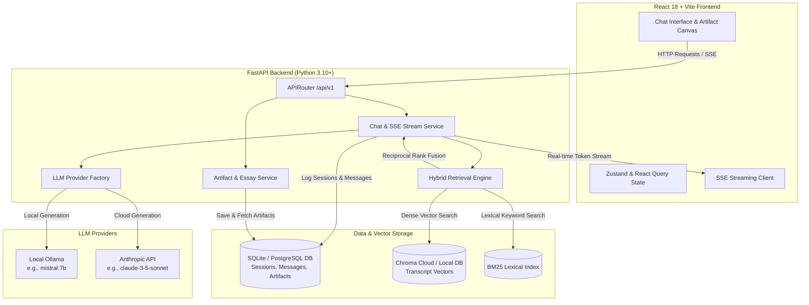

# 🚀 Lenny Growth Assistant

An AI-powered product management and growth research assistant built with **FastAPI**, **React (Vite + TypeScript)**, **Chroma Cloud RAG**, and **Multi-Provider LLMs** (Ollama & Anthropic Claude).

Lenny Growth Assistant ingests, indexes, and synthesizes insights from podcast transcripts, growth articles, and strategy frameworks. It delivers real-time streaming answers with exact timestamp citations and generates polished, structured atomic essays (Ship 30 for 30 style) and actionable strategy artifacts in an interactive Canvas view.

---

## 🏛️ System Architecture Overview

The platform uses a modular, decoupled architecture where the React frontend, FastAPI backend, relational database, Chroma vector database, hybrid retrieval pipeline, and LLM providers work in sync.



### Component Breakdown

1. **React 18 + TypeScript Frontend (`/frontend`)**:
   - Modern, responsive UI constructed with Vite, Tailwind CSS, Lucide icons, and Framer Motion.
   - **Real-Time Streaming**: Consumes Server-Sent Events (SSE) from the FastAPI backend to stream responses token-by-token.
   - **Dual Pane Layout**: Integrated chat stream on the left and an expandable Artifact Canvas on the right for reviewing generated essays, code blocks, and markdown summaries.
   - **Session & Setting Controls**: Allows switching between models (Ollama vs. Anthropic) on the fly and managing historical chat threads.

2. **FastAPI Backend Server (`/backend`)**:
   - Exposes clean RESTful endpoints under `/api/v1/` for session management, message retrieval, artifact operations, and settings configuration.
   - Orchestrates the full RAG workflow, streaming responses via `EventSourceResponse`.
   - Uses **SQLAlchemy ORM** with automatic database migrations (via Alembic & `init_db`).

3. **Hybrid RAG & Retrieval Engine (`/backend/app/retrieval`)**:
   - **Dense Retrieval**: Connects to **Chroma Cloud** (or local ChromaDB) using `SentenceTransformers` (`all-MiniLM-L6-v2`) for semantic similarity search.
   - **Sparse Retrieval**: BM25 keyword matching for exact terminology, guest names, and specific framework references.
   - **Reciprocal Rank Fusion (RRF)**: Merges dense and sparse search rankings to deliver hyper-relevant transcript excerpts.
   - **Contextual Processing**: Includes query contextualization, topic parsing, and automatic spelling correction.

4. **Relational Database (`/backend/app/database`)**:
   - Manages relational domain models: `ChatSession`, `ChatMessage`, and `Artifact`.
   - Supports SQLite (`lenny_growth.db`) for lightweight local evaluation and PostgreSQL for production deployments.

5. **Multi-Provider LLM Layer (`/backend/app/providers`)**:
   - Dynamic provider factory supporting **Ollama** (`mistral:7b`, `llama3`) for zero-cost local execution, and **Anthropic** (`claude-3-5-sonnet-20240620`) for cloud inference.

---

## ✨ Key Features

- **⚡ Streaming Answers**: Real-time token streaming with instant feedback and visual source citation badges.
- **📚 Deep Citation & Timestamp Linkage**: Responses automatically link to exact episode sources and YouTube timestamps.
- **✍️ Atomic Essay Generation**: Synthesizes complex PM and growth advice into high-impact ~1250-word Ship 30 for 30 style atomic essays with clear takeaways, strong hooks, and bold formatting.
- **🎛️ Dynamic Provider Switching**: Switch between local Ollama LLMs and Anthropic Claude directly from the UI settings.
- **💾 Session & Artifact Persistence**: Save, re-open, and export past research sessions and generated artifacts.

---

## 🔐 Environment Variables Setup

> [!IMPORTANT]
> **Security Notice**: Never commit sensitive API keys to source control. Always copy `.env.example` to `.env` and fill in your private credentials locally.

### 1. Backend Environment Variables (`backend/.env`)

Copy `backend/.env.example` to `backend/.env`:

```bash
cp backend/.env.example backend/.env
```

| Variable | Default Value | Required? | Description |
| :--- | :--- | :--- | :--- |
| `DATABASE_URL` | `sqlite:///./lenny_growth.db` | Optional | Database connection string (SQLite or PostgreSQL) |
| `MODEL_PROVIDER` | `ollama` | Required | Active LLM provider (`ollama` or `anthropic`) |
| `OLLAMA_URL` | `http://localhost:11434` | Required if Ollama | URL for local Ollama service |
| `OLLAMA_MODEL` | `mistral:7b` | Required if Ollama | Ollama model name |
| `ANTHROPIC_API_KEY` | `""` | Required if Anthropic | Your Anthropic Claude API key (`sk-ant-...`) |
| `ANTHROPIC_MODEL` | `claude-3-5-sonnet-20240620` | Optional | Anthropic model identifier |
| `EMBEDDING_MODEL` | `all-MiniLM-L6-v2` | Required | HuggingFace embedding model for vector search |
| `CHROMA_API_KEY` | `""` | Required for Cloud | ChromaDB Cloud API key |
| `CHROMA_TENANT` | `""` | Required for Cloud | ChromaDB Cloud Tenant ID |
| `CHROMA_DATABASE` | `lenny_transcripts` | Optional | ChromaDB database name |
| `CHROMA_COLLECTION_NAME` | `Lenny_Assist` | Optional | ChromaDB vector collection name |

#### Sample `backend/.env`:

```env
DATABASE_URL=sqlite:///./lenny_growth.db

# LLM Provider: 'ollama' or 'anthropic'
MODEL_PROVIDER=ollama
OLLAMA_URL=http://localhost:11434
OLLAMA_MODEL=mistral:7b

# Anthropic (Optional if using Ollama)
ANTHROPIC_API_KEY=your-anthropic-api-key-here
ANTHROPIC_MODEL=claude-3-5-sonnet-20240620

# Vector Database (Chroma Cloud)
EMBEDDING_MODEL=all-MiniLM-L6-v2
CHROMA_API_KEY=your-chroma-api-key
CHROMA_TENANT=your-chroma-tenant-id
CHROMA_DATABASE=lenny_transcripts
CHROMA_COLLECTION_NAME=Lenny_Assist
```

---

### 2. Frontend Environment Variables (`frontend/.env`)

Copy `frontend/.env.example` to `frontend/.env`:

```bash
cp frontend/.env.example frontend/.env
```

| Variable | Default Value | Required? | Description |
| :--- | :--- | :--- | :--- |
| `VITE_API_URL` | `http://localhost:8000` | Required | Backend FastAPI base URL |

#### Sample `frontend/.env`:

```env
VITE_API_URL=http://localhost:8000
```

---

## 📦 Dependencies Installation Commands

### Prerequisites
- **Python**: 3.10 or higher
- **Node.js**: v18.0.0 or higher (with `npm`)
- **Git**: Installed
- *(Optional)* **Ollama**: Installed and running if using local LLM inference (`ollama serve`)

### Backend Setup & Dependencies

1. Navigate to the `backend` directory:
   ```bash
   cd backend
   ```

2. Create a Python virtual environment:
   - **Linux / macOS**:
     ```bash
     python3 -m venv .venv
     source .venv/bin/activate
     ```
   - **Windows (PowerShell)**:
     ```powershell
     python -m venv .venv
     .\.venv\Scripts\Activate.ps1
     ```

3. Upgrade `pip` and install dependencies:
   ```bash
   pip install --upgrade pip
   pip install -r requirements.txt
   ```

---

### Frontend Setup & Dependencies

1. Navigate to the `frontend` directory:
   ```bash
   cd frontend
   ```

2. Install Node dependencies using `npm`:
   ```bash
   npm install
   ```

---

## 🛠️ Step-by-Step Instructions: Deploy & Run Locally

Follow these step-by-step instructions to get the application up and running on your local machine.

### Step 1: Clone the Repository

```bash
git clone https://github.com/Athish2503/lenny-growth-assistant.git
cd lenny-growth-assistant
```

---

### Step 2: Configure Environment Variables

Create and configure your `.env` files for both backend and frontend as detailed in the [Environment Variables Setup](#-environment-variables-setup) section:

```bash
# Backend configuration
cp backend/.env.example backend/.env

# Frontend configuration
cp frontend/.env.example frontend/.env
```

---

### Step 3: Initialize Database & Run Indexing (Optional)

1. Activate your backend virtual environment:
   ```bash
   cd backend
   # Windows: .\.venv\Scripts\Activate.ps1 | Linux/macOS: source .venv/bin/activate
   ```

2. Run transcript vector indexing pipeline (if indexing new transcript files into ChromaDB):
   ```bash
   python -m app.retrieval.index_pipeline
   ```

---

### Step 4: Launch the FastAPI Backend Server

From the `backend` directory with virtual environment activated, run:

```bash
uvicorn app.main:app --reload --host 0.0.0.0 --port 8000
```

- The API server will start at: `http://localhost:8000`
- Interactive OpenAPI / Swagger Documentation will be accessible at: **`http://localhost:8000/docs`**

---

### Step 5: Launch the React Frontend Server

Open a new terminal window, navigate to the `frontend` directory, and run:

```bash
cd frontend
npm run dev
```

- The frontend application will start at: **`http://localhost:5173`**

---

### Step 6: Test & Evaluate the Application

1. Open your web browser and navigate to `http://localhost:5173`.
2. Try asking growth or product management questions (e.g. *"How do I determine product-market fit for B2B SaaS?"* or *"Summarize Lenny's best advice on pricing strategies"*).
3. Switch model provider via the **Settings Modal** (select between **Ollama** and **Anthropic**).
4. Click on generated **Artifacts** to open the side canvas view for formatted essays and takeaways.

---

## 🛣️ API Endpoints Summary

| Method | Endpoint | Description |
| :--- | :--- | :--- |
| `GET` | `/health` | Server health check endpoint |
| `GET` | `/api/v1/sessions` | Fetch list of all active chat sessions |
| `POST` | `/api/v1/sessions` | Create a new chat session |
| `GET` | `/api/v1/sessions/{session_id}` | Fetch session details and message history |
| `DELETE` | `/api/v1/sessions/{session_id}` | Delete a chat session |
| `POST` | `/api/v1/chat` | Send prompt & receive SSE streaming response |
| `GET` | `/api/v1/sessions/{session_id}/artifacts` | Fetch generated artifacts for a session |
| `POST` | `/api/v1/sessions/{session_id}/artifacts` | Create/Save a new artifact |
| `GET` | `/api/v1/settings` | Get current active LLM & retrieval settings |
| `POST` | `/api/v1/settings` | Update active LLM provider or model config |

---

## 🧪 Running Tests & Verification

### Backend Pytest Suite

Run all unit and integration tests from the `backend` directory:

```bash
cd backend
pytest -v
```

Tests cover:
- Retrieval pipeline & hybrid BM25 + dense search (`test_retrieval.py`, `test_retrieval_indexing.py`)
- Query contextualization & spelling correction (`test_query_contextualizer.py`, `test_spelling_corrector.py`)
- Artifact & essay generation service (`test_artifact_service.py`, `test_essay_service.py`)
- Session management & database models (`test_sessions.py`)
- API endpoints & router validation (`test_router.py`)

### Frontend Type Checking & Building

Run TypeScript validation and production build check from the `frontend` directory:

```bash
cd frontend
npm run lint
npm run build
```

---

## 📁 Repository Structure

```
lenny-growth-assistant/
├── backend/
│   ├── alembic/                # Database migration scripts
│   ├── app/
│   │   ├── api/                # FastAPI routes (chat, sessions, settings)
│   │   ├── core/               # Configuration settings & pydantic models
│   │   ├── database/           # SQLAlchemy models, sessions, base setup
│   │   ├── ingestion/          # Document loader, chunker, & metadata extraction
│   │   ├── providers/          # LLM provider factory (Ollama, Anthropic)
│   │   ├── retrieval/          # Hybrid search (Dense ChromaDB + Sparse BM25 + RRF)
│   │   ├── services/           # Chat, Essay, Artifact, & Session services
│   │   └── main.py             # FastAPI entrypoint & middleware setup
│   ├── tests/                  # Pytest test suite
│   ├── .env.example            # Sample backend environment file
│   ├── alembic.ini             # Alembic configuration
│   └── requirements.txt        # Python backend dependencies
├── frontend/
│   ├── src/
│   │   ├── components/         # Chat, Artifact Canvas, Settings, UI components
│   │   ├── services/           # Axios API client & SSE stream handler
│   │   ├── store/              # Zustand state management
│   │   ├── types/              # TypeScript interfaces & domain types
│   │   ├── App.tsx             # Root React application
│   │   └── main.tsx            # React DOM entrypoint
│   ├── .env.example            # Sample frontend environment file
│   ├── package.json            # Node.js dependencies & scripts
│   └── vite.config.ts          # Vite bundle configuration
└── README.md                   # Project documentation
```

---

## 🤝 License & Acknowledgments

- Transcripts and knowledge base content sourced from **[Lenny's Newsletter & Podcast](https://www.lennysnewsletter.com/)**.
- Built with ❤️ for product managers, growth leaders, and founders.
